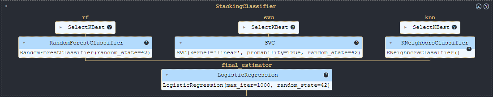

# Model Training and Evaluation Report

## 1. Introduction

This report evaluates several machine learning models applied to a classification problem that investigates the effects of music on mental health. The classification task aims to predict the impact of music, categorized into three classes:
- **Improves (1)**
- **No Effect (0)**
- **Worsens (-1)**

To address this problem, we undertook a structured process:

1. **Data Preparation:** The dataset was divided into training, validation, and test sets. 

2. **Model Selection:**
    We assessed a range of models and Each model was evaluated based on:
   - **Cross-Validation Accuracy:** The average accuracy across multiple folds of cross-validation on the training set.
   - **Validation Accuracy:** Accuracy on a separate validation set.
   - **Classification Metrics:** Precision, recall, and F1-score for each class.

3. **Selected Model Training and Evaluation:** The selected model, based on its performance across these metrics, was trained using both the training and validation sets. It was then evaluated on the test set to assess its performance on unseen data. \
Finally, the model was saved for future use, ensuring that it can be deployed without the need for retraining.

## 2. **Data Preparation**
The dataset was initially split into training/validation (80%) and test (20%) sets. The training set was further divided into training(75%) and validation(25%) subsets to enable both model training and evaluation. 

## 3. **Model Selection**
### 3.1. **Models**
___
We evaluated the following models using [StratifiedKFold cross-validation](https://scikit-learn.org/stable/modules/generated/sklearn.model_selection.StratifiedKFold.html):
- **RandomForestClassifier**: An ensemble method that constructs multiple decision trees and outputs the mode of their classes.
- **SVC (Support Vector Classification)**: A classifier that works by finding a hyperplane in a high-dimensional space that separates classes.
- **KNeighborsClassifier**: A simple, instance-based learning method that classifies data points based on the majority class among their nearest neighbors.
- **LogisticRegression**: A linear model used for binary classification tasks.
- **GaussianNB**: A probabilistic classifier based on Bayes’ theorem with an assumption of independence between features.
- **StackingClassifier**: Combines multiple classifiers (RandomForest, SVC, KNeighbors) with a final estimator (LogisticRegression) to improve prediction accuracy.
- **BaggingClassifier**: Uses bootstrapped samples of the training data to fit multiple instances of the base estimator (RandomForest).
- **GradientBoostingClassifier**: Builds models sequentially to correct errors made by previous models.
- **AdaBoostClassifier**: A boosting technique that focuses on misclassified instances to improve model accuracy.
- **VotingClassifier**: Combines multiple models by taking a majority vote of their predictions.

### 3.2. Evaluation Metrics
___
Models were evaluated using:

- **Cross-Validation Accuracy**: Average accuracy obtained from multiple folds of StratifiedKFold cross-validation.
- **Validation Accuracy**: Accuracy on a separate validation set.
- **Classification Report**: Includes precision, recall, and F1-score for each class.

### 3.3. Evaluation Results
___

Below are the detailed results ([cv results](../reports/model_evaluation_results.txt)):
| Model                    | Avg Cross-Validation Accuracy | Validation Accuracy | Precision (-1) | Precision (0) | Precision (1) | Recall (-1) | Recall (0) | Recall (1) | F1-Score (-1) | F1-Score (0) | F1-Score (1) |
|--------------------------|-------------------------------|---------------------|----------------|---------------|---------------|-------------|------------|------------|---------------|--------------|--------------|
| **RandomForest**         | 0.8615                        | 0.8892              | 0.98           | 0.84          | 0.85          | 0.99        | 0.86       | 0.81       | 0.99          | 0.85         | 0.83         |
| **SVC**                  | 0.7436                        | 0.7323              | 0.72           | 0.70          | 0.77          | 0.99        | 0.51       | 0.69       | 0.84          | 0.59         | 0.73         |
| **KNeighbors**           | 0.7518                        | 0.7538              | 0.83           | 0.65          | 0.89          | 1.00        | 0.90       | 0.36       | 0.90          | 0.75         | 0.51         |
| **LogisticRegression**   | 0.7405                        | 0.7262              | 0.81           | 0.65          | 0.69          | 0.95        | 0.54       | 0.69       | 0.87          | 0.59         | 0.69         |
| **GaussianNB**           | 0.6646                        | 0.6462              | 0.62           | 0.56          | 0.74          | 0.91        | 0.32       | 0.70       | 0.74          | 0.41         | 0.72         |
| **StackingClassifier**   | **0.8749**                        | **0.9138**              | 0.98           | 0.90          | 0.86          | 0.99        | 0.87       | 0.88       | 0.99          | 0.88         | 0.87         |
| **BaggingClassifier**    | 0.8595                        | 0.8769              | 0.97           | 0.82          | 0.84          | 0.99        | 0.86       | 0.78       | 0.98          | 0.84         | 0.81         |
| **GradientBoostingClassifier** | 0.8297                        | 0.8677              | 0.97           | 0.81          | 0.82          | 1.00        | 0.82       | 0.78       | 0.99          | 0.82         | 0.80         |
| **AdaBoostClassifier**   | 0.8554                        | 0.8892              | 0.97           | 0.85          | 0.85          | 0.98        | 0.87       | 0.81       | 0.98          | 0.86         | 0.83         |
| **VotingClassifier**     | 0.7692                        | 0.7354              | 0.76           | 0.68          | 0.74          | 0.98        | 0.52       | 0.70       | 0.86          | 0.59         | 0.72         |

### 3.4. Model Selection
___
The StackingClassifier was selected as the final model due to:

- **Highest average cross-validation accuracy**: 0.8749.
- **Highest validation accuracy:** 0.9138.
- **Superior performance across metrics**, especially with high F1-scores for class -1 and balanced performance for other classes.

## 4. **Selected Model Training and Evaluation**
The StackingClassifier was further optimized with **regularization** on its base estimators. Feature selection was performed using `SelectKBest`, resulting in the selection of 32 features. 
### 4.1. **Model Architecture**
___
**1. Base Estimators:**

- **RandomForestClassifier ("rf")**
  - **Parameters:**
    - `random_state=42`: Ensures reproducibility by setting a fixed seed for random number generation.

- **Support Vector Classification ("svc")**
  - **Parameters:**
    - `C=1.0`: **Regularization** parameter that controls the trade-off between achieving a low training error and a low testing error.
    - `kernel="linear"`: Uses a linear kernel to find the separating hyperplane.
    - `probability=True`: Enables probability estimates which are useful for the stacking model.
    - `random_state=42`: Ensures reproducibility by setting a fixed seed for random number generation.

- **KNeighborsClassifier ("knn")**
  - **Parameters:** Defaults are used, meaning no specific values for the number of neighbors or distance metric are set.

**2. Final Estimator:**

- **LogisticRegression**
  - **Purpose:** Acts as the meta-classifier that combines the predictions of the base estimators to make the final classification decision.
  - **Parameters:**
    - `solver="lbfgs"`: Optimization algorithm used to find the best-fit model parameters.
    - `C=1.0`: **Regularization** parameter to control the complexity of the model.
    - `penalty="l2"`: **Regularization** term to prevent overfitting by penalizing large coefficients.
    - `max_iter=1000`: The maximum number of iterations to converge to the solution, ensuring that the model has sufficient time to find the optimal solution.
    - `random_state=42`: Ensures reproducibility by setting a fixed seed for random number generation.

**3. Model Workflow:**

- **Pipeline Construction:**
  Each base estimator is wrapped in a pipeline. Although not explicitly stated, this typically involves preprocessing steps such as scaling or normalization, which are crucial for many machine learning models to perform optimally. The `create_pipeline` function likely encapsulates these preprocessing steps.

- **Training:**
  The StackingClassifier trains the base estimators on the training data. Each base estimator makes predictions on the training set, and these predictions are then used as inputs for the final estimator (Logistic Regression).

- **Final Estimator:**
  The Logistic Regression model is trained using the predictions from the base models. It learns how to best combine these predictions to make the final classification decision.

- **Prediction:**
  When making predictions on new data, each base model provides a prediction, which is passed to the final estimator. The final estimator combines these predictions to produce the final output.

### **4.2. Model Training and Evaluation**
___
The final model was trained on the entire training set (combined training and validation sets) and tested on the test set.
- **Test Accuracy**: *0.9049*

- **Classification Report:**

    | Metric       | Class -1 | Class 0 | Class 1 |
    |--------------|----------|---------|---------|
    | **Precision**| 1.00     | 0.88    | 0.84    |
    | **Recall**   | 1.00     | 0.83    | 0.89    |
    | **F1-Score** | 1.00     | 0.85    | 0.86    |

- Features not selected by any of the models are `freq_metal` and `ocd`

- **Confusion Matrix**
The normalized confusion matrix was plotted to visualize the model's performance.

### 4.3. **Model Saving**
___
The final StackingClassifier model was saved for future use, allowing for reuse without retraining.

## 5. **Conclusion**
The StackingClassifier has demonstrated superior performance in classifying the effects of music on mental health, outperforming other evaluated models. With a testing accuracy of 0.90, the StackingClassifier effectively integrates predictions from multiple base models—RandomForest, SVC, and KNeighborsClassifier—using a Logistic Regression final estimator.

Key highlights include:

- **Exceptional Precision and Recall:** The model achieved high precision and recall across all classes, with notable performance for class -1 (Improves), which exhibited perfect scores.
- **Balanced F1-Scores:** The F1-scores for each class reflect a balanced performance, with the model maintaining robust accuracy for both positive and negative impacts of music.

Overall, the StackingClassifier provides a powerful tool for analyzing and predicting the impact of music on mental health, offering valuable insights and a solid foundation for further research and development.

## 6. **Future Work**

While the current evaluation of the StackingClassifier has shown promising results, there are several areas for future improvement and exploration:

1. **Hyperparameter Optimization:** Performing a more extensive hyperparameter tuning process for both the base estimators and the final estimator in the StackingClassifier.

2. **Feature Engineering:**
Experimenting with creating new features or deriving additional information from existing features to enhance model performance.

3. **Exploring Additional Models:**
   Investigating the performance of more complex models such as deep learning architectures or ensemble techniques that combine multiple advanced algorithms.

These future work areas aim to enhance the model's accuracy, adaptability, and applicability, ultimately leading to more insightful and reliable predictions.

